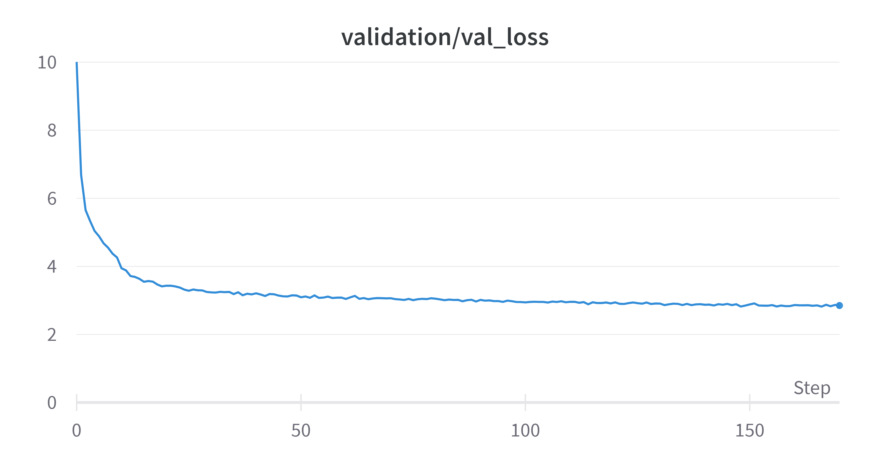

# microGPT: Building GPT from scratch
microGPT is a lightweight implementation of the Generative Pre-trained Transformer (GPT) model for natural language processing tasks. It is designed to be simple and easy to use, making it a great option for small-scale applications or for learning and experimenting with generative models.

## Features
-  Lightweight implementation of the GPT models
-  Trained on a [small scaled dataset](https://arxiv.org/abs/2304.08442) (6 GB)
-  Designed to be trained on consumer GPU (RTX 4060 8GB)
-  Small number of parameters (82 Million!)
-  Customizable hyperparameters for model configuration
-  Supports Top K Top P filtering and temperature scaling
-  Written in Python with PyTorch as the deep learning framework


<p align="center" style="margin: 3%;">
	
    300k iterations of training
</p>

## Installation
1. Clone the repo and run `pip install -r requirements.txt`

## Usage
1. Run `tokenizer/train_tokenizer.py` to generate the tokenizer file. The model will tokenize text based on it.
2. Run `datasets/prepare_dataset.py` to generate dataset files.
3. Run `train.py` to start training~

**Modify the files stated above if you wish to change their parameters.**

## Usage (Inference)
To edit model generation parameters, head over `inference.py` to this section:
```py
# Parameters (Edit here):
n_tokens = 1000
temperature = 0.8
top_k = 0
top_p = 0.9
model_path = 'models/microGPT.pth'

# Edit input here
context = "The magical wonderland of"
```

Interested to deploy as a web app? Check out [microGPT-deploy](https://github.com/LeeSinLiang/microGPT-deploy) !

## Contribution
If you would like to contribute, please follow these guidelines:

-   Fork the repository and create a new branch for your contribution.
-   Make sure your changes align with the goals and purpose of the repository.
-   Keep your commits clear and descriptive, following the [Conventional Commits](https://www.conventionalcommits.org/en/v1.0.0/) format.
-   Write clear and concise code with appropriate comments and documentation.
-   Test your changes thoroughly to ensure they do not introduce new bugs.
-   Submit a pull request (PR) with a detailed description of your changes, along with any relevant information or screenshots.

By contributing to this repository, you agree to abide by our [Code of Conduct](https://github.com/LeeSinLiang/microGPT/blob/main/CODE_OF_CONDUCT.md) and that your contributions will be released under the same [License](https://github.com/LeeSinLiang/microGPT/blob/main/LICENSE) as the repository.

## Resources
- [Attention is all you need](https://arxiv.org/abs/1706.03762)
- [Let's build GPT from scratch](https://youtu.be/kCc8FmEb1nY)
- [The MiniPile Challenge for Data-Efficient Language Models](https://arxiv.org/pdf/2304.08442.pdf)
- [Huggingface GPT 2 implementation](https://github.com/huggingface/transformers/tree/main/src/transformers/models/gpt2)

## Credits
This model is inspired by Andrej Karpathy [Let's build GPT from scratch video](https://youtu.be/kCc8FmEb1nY) and Andrej Kaparthy [nanoGPT](https://github.com/karpathy/nanoGPT/) with modifications for my own uses.


